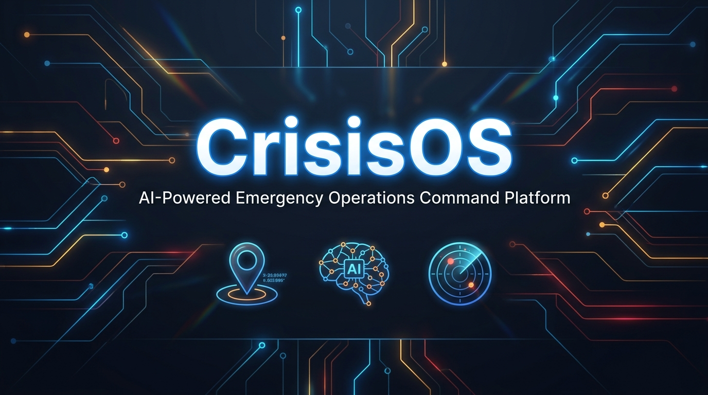

<p align="center">
  
</p>

<div align="center">

# ?? CrisisOS — AI-Powered Emergency Operations Command Platform

**Real-time multi-agency incident command, AI dispatch optimization, geospatial situation awareness, and Digital Twin simulation — all in one unified platform.**

[](https://nextjs.org/)
[](https://www.typescriptlang.org/)
[](https://www.prisma.io/)
[](./tests/run-tests.ts)
[](./LICENSE)

[?? Live Demo](#-live-demo) • [??? Architecture](#-architecture) • [? Features](#-key-features) • [?? Quick Start](#-quick-start)

</div>

---

## ?? The Problem

When disasters strike — floods, fires, hazmat leaks, mass casualties — emergency coordinators face:

- ?? **Information overload** across 911 calls, field reports, hospital capacities, and fleet status
- ?? **Critical seconds lost** matching the right resource to the right incident
- ?? **Fragmented systems** — separate tools for dispatch, resource tracking, hospital liaison, and field ops
- ?? **Black-box AI tools** that recommend actions without explaining why, forcing coordinators to second-guess life-or-death decisions

**CrisisOS solves all of this in one unified command platform.**

---

## ? Key Features

### ??? Live Geospatial Situation Room
Real-time interactive map showing all active incidents, fleet units, hospitals, and shelters. Toggle layers, click entities for instant SITREP, and link directly to Dispatch Studio.

### ? AI Dispatch Studio — Explainable AI with Human Authorization
- **Factor-by-factor scoring**: Base Readiness ? Transit ETA Cost ? Distance Offset ? Reliability Rating ? Workload Penalty ? Availability Bonus ? Urgency Bonus
- **Hard capability filtering**: Units lacking required capabilities are never recommended
- **Human Authorization Gate**: AI recommends, humans approve — every dispatch requires explicit sign-off
- **Audit trail**: Every approval, rejection, and commander override is permanently logged

### ?? AI Commander — Executive SITREP Engine
- **Confirmed Facts** with field telemetry attribution and confidence percentages
- **Unverified Reports** clearly flagged with uncertainty reasons
- **Priority Risks** with probabilistic cascade timelines
- **Resource Bottlenecks** with live deficit calculations and mitigation strategies
- **Tactical Copilot** — natural language Q&A backed by live database telemetry

### ?? Digital Twin Simulation — Production Isolated
- Full sandbox isolation proof (`productionDatabaseMutated: false`)
- Cascade risk indicators: Urban Drainage, Regional Grid, Hospital Trauma Surge
- Live vs. Simulated comparison with real operational baseline

### ?? VoiceDispatch 911 Console
Structured 911 incident intake with real-time transcription-style UI, triage classification, and automatic incident record creation.

### ?? Hospital & Shelter Network
Live bed availability, ICU capacity tracking, and shelter occupancy across the entire regional network.

### ?? Immutable Audit Log
Complete tamper-evident audit trail for every approval, rejection, override, and status transition.

---

## ??? Architecture

```
+-----------------------------------------------------+
¦                    CrisisOS Platform                 ¦
+-----------------------------------------------------¦
¦  Next.js 16 ¦   React 19   ¦  TypeScript 5          ¦
¦  App Router ¦   Zustand    ¦  Zod Validation        ¦
+-----------------------------------------------------¦
¦              API Layer (Next.js Route Handlers)      ¦
¦  /incidents  /resources  /dispatch  /hospitals       ¦
¦  /simulation  /ai-commander  /audit  /shelters       ¦
+-----------------------------------------------------¦
¦              Business Logic                          ¦
¦  capability-matcher.ts    ai/commander-service.ts   ¦
¦  Explainable Scoring      SITREP Engine              ¦
+-----------------------------------------------------¦
¦              Data Layer                              ¦
¦  Prisma ORM  ·  SQLite (dev) / PostgreSQL (prod)    ¦
+-----------------------------------------------------¦
¦              External Services                       ¦
¦  Leaflet + CARTO Dark Maps  ·  react-leaflet v5      ¦
¦  Recharts Analytics         ·  Radix UI Primitives   ¦
+-----------------------------------------------------+
```

### Key Design Principles
- **Human-in-the-Loop AI**: Every AI recommendation requires explicit human authorization
- **Explainable by Default**: All AI decisions expose factor-by-factor reasoning
- **Production Isolation**: Digital Twin sandbox is separated from live operational data
- **Audit Everything**: All actions create immutable audit records

---

## ?? Application Pages

| Route | Module | Description |
|-------|--------|-------------|
| `/dashboard` | Operations Dashboard | Real-time KPI overview, incident heatmap, resource availability |
| `/map` | Situation Room | Live geospatial incident & fleet map with layer toggles |
| `/incidents` | Incident Command | Full incident lifecycle management with SITREP & timeline |
| `/dispatch` | AI Dispatch Studio | Explainable AI resource matching with human authorization gate |
| `/ai-commander` | AI Commander | Executive SITREP engine with tactical copilot Q&A |
| `/simulation` | Digital Twin | Isolated disaster scenario simulation with cascade modeling |
| `/voicedispatch` | VoiceDispatch | 911 intake console with structured triage |
| `/resources` | Resource Management | Fleet tracking with real-time status and GPS telemetry |
| `/hospitals` | Hospital Network | Regional bed & ICU capacity dashboard |
| `/audit` | Audit Log | Immutable operations compliance trail |
| `/analytics` | Analytics | Historical trends, response time analysis |

---

## ?? Quick Start

### Prerequisites
- **Node.js** 20+
- **npm** 9+

### 1. Clone the repository
```bash
git clone https://github.com/mellowpraful/vistaraz.git
cd vistaraz
```

### 2. Install dependencies
```bash
npm install
```

### 3. Set up the database
```bash
# Push schema to SQLite (development)
npm run db:push

# Seed with realistic demo data (Ahmedabad flood scenario)
npm run db:seed
```

### 4. Start the development server
```bash
npm run dev
```

Open [http://localhost:3000](http://localhost:3000) — the dashboard loads immediately with live demo data.

### 5. Run the test suite
```bash
npm test
# Expected: 66/66 tests passing ?
```

---

## ?? Test Coverage

```
Test Suite: 66/66 ? — 0 failures

? A•1  — Dashboard API (incidents, resources, hospitals, shelters)
? A•2  — Incident CRUD & status transitions
? A•3  — Resource fleet management & status updates
? A•4  — VoiceDispatch 911 intake & triage
? A•5  — Dispatch recommendation engine & scoring
? A•6  — Explainable scoring factor breakdown
? A•7  — AI Commander SITREP generation (16 assertions)
? A•8  — Digital Twin isolation proof
? A•9  — Dispatch approval/rejection/override schemas
? A•10 — Eligibility audit & hard capability filtering
? A•11 — Audit log immutability
```

---

## ??? Tech Stack

| Layer | Technology | Purpose |
|-------|-----------|---------|
| **Framework** | Next.js 16 (App Router) | Full-stack React with RSC + API routes |
| **Language** | TypeScript 5 | End-to-end type safety |
| **UI** | React 19 + Radix UI | Accessible component primitives |
| **Styling** | Tailwind CSS v4 + Vanilla CSS | Utility-first + custom design system |
| **Maps** | Leaflet + react-leaflet v5 | Geospatial situation awareness |
| **Charts** | Recharts 3 | Analytics & capacity visualization |
| **ORM** | Prisma 6 | Type-safe database access |
| **Database** | SQLite (dev) / PostgreSQL (prod) | Operational data persistence |
| **Validation** | Zod 4 | Runtime schema validation |
| **State** | Zustand 5 | Lightweight client state management |
| **Icons** | Lucide React | Consistent icon system |
| **Testing** | TSX + custom test runner | 66-test integration suite |

---

## ?? Project Structure

```
vistaraz/
+-- src/
¦   +-- app/
¦   ¦   +-- (app)/              # All app pages
¦   ¦   ¦   +-- dashboard/      # Operations command center
¦   ¦   ¦   +-- map/            # Live situation room
¦   ¦   ¦   +-- incidents/      # Incident management
¦   ¦   ¦   +-- dispatch/       # AI dispatch studio
¦   ¦   ¦   +-- ai-commander/   # AI executive SITREP
¦   ¦   ¦   +-- simulation/     # Digital twin
¦   ¦   ¦   +-- voicedispatch/  # 911 console
¦   ¦   ¦   +-- resources/      # Fleet management
¦   ¦   ¦   +-- hospitals/      # Hospital network
¦   ¦   ¦   +-- audit/          # Compliance audit log
¦   ¦   +-- api/                # Next.js route handlers
¦   +-- components/
¦   ¦   +-- map/                # Leaflet map components
¦   ¦   +-- ui/                 # Design system components
¦   +-- lib/
¦       +-- ai/
¦       ¦   +-- commander-service.ts  # AI SITREP & copilot engine
¦       +-- capability-matcher.ts     # Explainable dispatch scoring
¦       +-- demo-data.ts              # Realistic Ahmedabad flood scenario
¦       +-- types.ts                  # Shared TypeScript types
+-- prisma/
¦   +-- schema.prisma           # Full data model
¦   +-- seed.ts                 # Demo data seeding
+-- tests/
¦   +-- run-tests.ts            # 66-test integration suite
+-- public/
    +-- banner.jpg              # Project banner
```

---

## ?? Demo Scenario: Ahmedabad Flood Response 2026

CrisisOS ships with a realistic multi-agency flood response scenario:

- **12 active incidents** across Ahmedabad — fires, hazmat leaks, flood evacuations, medical emergencies
- **20+ resource units** — ambulances, fire engines, boats, drones, hazmat teams
- **8 hospitals** with live bed & ICU capacity tracking
- **6 shelters** with occupancy and supply status
- **Sabarmati River** surge simulation with cascade modeling through 3 sectors

---

## ?? Safety & Ethics

CrisisOS is built with strict human-in-the-loop guardrails:

- ?? **No autonomous dispatch** — AI recommends, humans authorize every deployment
- ?? **Mandatory rejection rationale** — operators must explain every AI override
- ?? **Full explainability** — every AI score exposes factor-by-factor reasoning
- ?? **Simulation isolation** — Digital Twin sandbox cannot mutate live operational records
- ?? **Audit everything** — immutable compliance trail for every decision

---

## ?? Team

Built with ?? by a collaborative development team:

| Agent | Domain |
|-------|--------|
| **Agent 1** | Incident Command, VoiceDispatch 911 Console |
| **Agent 2** | Resource Fleet Management, Dispatch Studio |
| **Agent 3** | UI/UX Design System, Global Styling, API Stability |
| **Agent 4** | AI Commander Service, Digital Twin Simulation, QA Integration |

---

## ?? License

MIT License — see [LICENSE](./LICENSE) for details.

---

<div align="center">

**Built for International Hackathon 2026**

*"When seconds count, CrisisOS delivers clarity."*

? **Star this repo** if you find it useful!

[](https://github.com/mellowpraful/vistaraz)

</div>
