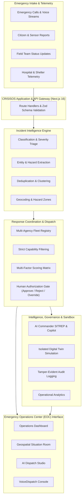

<p align="center">
  
</p>

# CRISISOS

### Intelligent Emergency Response & Resource Coordination Platform

**A multi-agency incident command, explainable dispatch coordination, geospatial situation awareness, and digital twin simulation platform designed to assist emergency operations centers during large-scale crises.**

[](https://nextjs.org/)
[](https://www.typescriptlang.org/)
[](https://www.prisma.io/)
[](https://react.dev/)
[](https://leafletjs.com/)
[](./tests/run-tests.ts)
[](https://vistaraz.vercel.app/dispatch)

[Live Prototype Demo](https://vistaraz.vercel.app/dispatch) &nbsp;&bull;&nbsp; [System Architecture](#system-architecture) &nbsp;&bull;&nbsp; [Core Capabilities](#core-capabilities) &nbsp;&bull;&nbsp; [Quick Start](#getting-started) &nbsp;&bull;&nbsp; [Technical Documentation](#technical-documentation-index)

---

## Overview

During complex natural disasters, industrial hazards, or urban emergencies, Emergency Operations Centers (EOCs) face severe operational friction: disparate data streams, uncoordinated agency communications, and incomplete visibility across responding units, available hospital beds, and civilian shelters.

**CRISISOS** consolidates incoming emergency telemetry into a single, cohesive decision-support platform. It assists human commanders and dispatch operators by structuring unstructured reports, running capability-first resource matching, forecasting secondary hazard cascades through an isolated digital twin sandbox, and logging every decision to an immutable audit trail.

> **Human-in-the-Loop Design Principle:** CRISISOS is an emergency decision-support platform built to augment and assist trained incident commanders. It does not replace human judgment, nor does it conduct autonomous dispatching. Every deployment, prioritization, and resource allocation requires explicit human authorization.

---

## The Problem (Problem Statement 9)

In conventional disaster management environments, emergency coordination suffers from structural bottlenecks:

- **Fragmented Ingestion Channels:** Emergency phone calls, citizen reports, field radios, environmental sensors, hospital updates, and municipal departments operate in isolated data silos.
- **Latency in Resource Allocation:** Coordinators manually search fleet registries to find specialized units, losing critical minutes during golden-hour responses.
- **Proximity-Only Misallocation:** Legacy Computer-Aided Dispatch (CAD) systems often recommend the closest unit geographically, dispatching standard vehicles to scenes requiring specialized capabilities (e.g., sending a patrol car to a flood rescue instead of an inflatable boat crew).
- **Opaque Automation Systems:** Black-box decision engines create liability and operator hesitation because they fail to provide explainable justifications for recommendations.
- **Cascading Failure Blindspots:** Responders tackle localized events without visibility into secondary regional risks, such as floodwaters threatening electrical substations or localized trauma surges exhausting nearby ICU capacity.

---

## The Solution

CRISISOS unifies emergency intake, tactical analysis, resource management, and operational dispatch into an integrated platform:

1. **Multi-Source Incident Ingestion:** Collects, deduplicates, and standardizes emergency reports across multiple channels (calls, field teams, citizen alerts, sensors).
2. **AI-Assisted Entity Extraction & Triage:** Automatically parses unstructured incident narratives into structured classifications, severity levels, casualty counts, and required capabilities.
3. **Capability-First Resource Recommendation:** Enforces strict capability eligibility constraints before evaluating travel time, proximity, unit workload, and historical reliability.
4. **Explainable Human Authorization Gates:** Provides factor-by-factor scoring transparency for every AI recommendation, enforcing mandatory operator sign-off, recorded rejection rationales, and commander override tracking.
5. **Geospatial Situation Room:** Integrates real-time map tracking of incidents, fleet vehicles, trauma centers, and shelters with dynamic hazard buffer overlays.
6. **Digital Twin Disaster Sandbox:** Simulates multi-hour cascade failure scenarios in an isolated environment that never touches or mutates active operational records.
7. **Immutable Compliance Audit Trail:** Records all status changes, approvals, overrides, and administrative actions with actor identification, timestamps, and state snapshots.

---

## Core Capabilities

| Capability | Module | Implementation Description | Status |
|---|---|---|:---:|
| **Emergency Operations Dashboard** | `/dashboard` | High-level situation overview featuring real-time incident counters, fleet readiness gauges, critical alerts, and regional summaries. | Implemented |
| **Geospatial Situation Room** | `/map` | Interactive map visualization with dynamic layer toggles for incidents, fleet units, hospitals, shelters, and flood hazard zones. | Implemented |
| **Incident Command & Detail** | `/incidents`, `/incidents/[id]` | Comprehensive incident lifecycle tracking (Reported $\to$ Verified $\to$ Assigned $\to$ In Progress $\to$ Resolved), timeline event logs, and status transitions. | Implemented |
| **RapidAid Dispatch Studio** | `/dispatch` | Explainable candidate matching matrix, factor-by-factor scoring breakdown, and mandatory human authorization workflows. | Implemented |
| **Resource & Fleet Registry** | `/resources` | Multi-agency fleet registry with real-time status management, workload gauges, equipment tag parsing, and telemetry freshness tracking. | Implemented |
| **AI Commander & SITREP Engine** | `/ai-commander` | Live operational intelligence synthesis highlighting confirmed facts, unverified reports, priority risks, resource bottlenecks, and an interactive tactical copilot. | Implemented |
| **VoiceDispatch 911 Console** | `/voicedispatch` | Emergency intake interface featuring simulated audio frequency visualizers, multilingual triage (English, Hindi, Gujarati), and structured entity extraction. | Implemented |
| **Digital Twin Simulation Sandbox** | `/simulation` | Isolated sandbox modeling time-stepped disaster cascades (drainage failure, grid blackout, trauma center surge) without mutating live data. | Implemented |
| **Hospital Trauma Network** | `/hospitals` | Regional trauma center tracking with total bed counts, active occupancy, live ICU availability, and divert status flags. | Implemented |
| **Civilian Evacuation Shelters** | `/shelters` | Emergency shelter network tracking total capacities, current occupant counts, and critical resource provision statuses. | Implemented |
| **Compliance Audit Trail** | `/audit` | Tamper-evident operational activity log capturing timestamps, actor roles, entity IDs, actions, and historical state snapshots. | Implemented |
| **Operational Analytics** | `/analytics` | Historical trends, incident distribution charts, response time telemetry, and fleet utilization metrics. | Implemented |

---

## System Architecture

CRISISOS utilizes a modular, full-stack Next.js architecture with clean separation across presentation, API routing, business logic, and persistence.



### Architectural Principles

- **Separation of Concerns:** Route handlers (`src/app/api/*`) validate request payloads via Zod, delegating business logic to domain services (`src/lib/dispatch/*`, `src/lib/ai/*`).
- **Explainability by Design:** Dispatch algorithms generate granular point allocations for each scoring factor rather than returning opaque scalar rankings.
- **Human Authority Preservation:** Consequential actions (dispatch approvals, status updates, resource reassignments) require explicit operator review.
- **Complete Sandbox Isolation:** The digital twin simulation engine operates under dedicated identifiers (`simulationId`), ensuring test simulations cannot alter live operational records.
- **Synchronous Governance Logging:** State mutations trigger atomic writes to the audit log table, ensuring an unbroken chain of custody.

---

## Technology Stack

The repository utilizes the following verified dependencies and frameworks:

| Layer | Technology | Specification / Version | Purpose |
|---|---|---|---|
| **Frontend Framework** | Next.js | `16.3.5` (App Router) | Server-side rendering, client hydration, and routing |
| **Core Library** | React | `19.2.8` | Declarative user interfaces |
| **Language** | TypeScript | `5.x` | Static typing and interface contracts across all layers |
| **Styling & Design** | Tailwind CSS / CSS | `@tailwindcss/postcss ^4`, Vanilla CSS | Operational design system, dark-mode styling, and layouts |
| **UI Components** | Radix UI Primitives | Dialog, Dropdown, Tabs, Tooltip, Slot | Accessible, keyboard-navigable component primitives |
| **Mapping Engine** | Leaflet & React-Leaflet | `leaflet ^1.9.4`, `react-leaflet ^5.0.0` | Geospatial situation map with vector markers and circles |
| **Cartography Tiles** | OpenStreetMap (OSM) | Standard tile layer with dark CSS filter | Free, reliable basemap rendering without third-party API keys |
| **Database ORM** | Prisma ORM | `6.4.1` | Type-safe database queries, migrations, and seeding |
| **Database Engine** | SQLite (dev) / PostgreSQL (prod) | Direct file DB locally; PostgreSQL ready | Operational data persistence with zero local configuration |
| **Data Validation** | Zod | `4.6.5` | Strict runtime input validation and API schema enforcement |
| **State Management** | Zustand | `5.0.15` | Client-side UI state handling |
| **Data Visualization** | Recharts | `3.10.1` | Analytics, capacity graphs, and trend visualization |
| **Test Runner** | tsx / Custom Harness | `tsx ^4.19.3` | Integration and algorithmic test suite execution |

---

## Application Modules

| Route | Module | Purpose |
|---|---|---|
| `/dashboard` | Operations Dashboard | Delivers a unified high-level command summary of active incidents, fleet status, and alerts. |
| `/map` | Situation Room | Displays real-time geospatial locations of incidents, fleet units, hospitals, and hazard zones. |
| `/incidents` | Incident Management | Tracks incoming emergency incidents through their complete operational lifecycle and timeline. |
| `/incidents/[id]` | Incident Detail | Provides deep inspection of an individual incident including SITREP details, location, and assigned units. |
| `/dispatch` | RapidAid Dispatch Studio | Evaluates and presents explainable AI resource recommendations with human approval controls. |
| `/ai-commander` | AI Commander | Synthesizes verified field telemetry into executive SITREPs with an interactive tactical copilot. |
| `/simulation` | Digital Twin Sandbox | Simulates disaster cascade scenarios across infrastructure and hospitals in an isolated environment. |
| `/voicedispatch` | VoiceDispatch Console | Simulates structured emergency call intake with audio visualization and entity extraction. |
| `/resources` | Resource Fleet Registry | Tracks multi-agency vehicle and crew availability, active missions, equipment, and telemetry age. |
| `/hospitals` | Hospital Trauma Network | Monitors regional emergency hospital capacity, ICU bed availability, and patient influx. |
| `/shelters` | Evacuation Shelters | Tracks evacuation facility capacities, current occupancy levels, and emergency supplies. |
| `/audit` | Compliance Audit Log | Provides a tamper-evident audit record of all dispatch approvals, rejections, and overrides. |
| `/analytics` | Analytics & Reports | Surfaces response time metrics, incident volume trends, and agency workload distributions. |
| `/register-incident` | Incident Intake Form | Allows operators to manually log new incidents with geographic coordinate pickers and hazard tags. |

---

## AI & Decision Support Architecture

CRISISOS incorporates AI assistance to eliminate data entry bottlenecks and synthesize high-volume emergency telemetry.

### 1. Structured Entity Extraction (`src/lib/ai/mock-analyzer.ts`)
Incoming raw narratives from phone calls, radio transmissions, or field messages are processed by an extraction pipeline that produces structured incident data:
- **Incident Categorization:** Maps descriptions into standardized types (`FLOOD`, `FIRE`, `HAZMAT`, `ROAD_ACCIDENT`, `MEDICAL`, `BUILDING_COLLAPSE`, `SEARCH_RESCUE`).
- **Severity Assessment:** Evaluates casualty mentions, environmental hazards, and urgency to assign calibrated severity grades (`CRITICAL`, `HIGH`, `MEDIUM`, `LOW`).
- **Casualty & Entity Identification:** Extracts estimated affected persons, confirmed injuries, and entrapment states.
- **Topographical & Hazard Flags:** Highlights secondary dangers including submerged power cables, combustible vapors, structural instability, or rapid water currents.
- **Required Capability Determination:** Identifies mandatory responder skills and equipment needed on scene (e.g., `WATER_RESCUE`, `HAZMAT_CONTAINMENT`, `ALS_PARAMEDIC`).

### 2. Executive SITREP Engine (`src/lib/ai/commander-service.ts`)
The AI Commander continuously analyzes active database records to generate an executive-level Situation Report:
- **Confirmed Facts:** Verified incidents with telemetry confidence $\ge 80\%$, explicitly attributed to source field teams.
- **Unverified Reports:** Low-confidence citizen reports flagged with transparent uncertainty reasons and recommended field verification tasks.
- **Priority Risks & Cascades:** Calculates multi-sector vulnerability pathways (e.g., river surge leading to sub-station water inundation).
- **Resource Bottleneck Tracking:** Computes real-time deficits between required capabilities and available reserve units.

### 3. Tactical Copilot Interface
Incident commanders can query the operational state using natural language. The copilot accesses live database telemetry to answer questions regarding trauma bed capacity, flood zone proximity, hazmat equipment availability, and mutual-aid agreements.

---

## Resource Coordination & Dispatch Logic

The resource matching engine (`src/lib/dispatch/capability-matcher.ts`) enforces an explainable, capability-first allocation pipeline:

```
Incident Requirements
       │
       ▼
Phase 1: Hard Constraint Eligibility Filtering
  ├── Must possess ALL mandatory capabilities (e.g., WATER_RESCUE)
  ├── Operational status must be AVAILABLE or STANDBY
  └── Must not exceed active deployment workload limits
       │
       ▼ (Candidate Pool)
Phase 2: Multi-Factor Explainable Scoring (0 - 100 Scale)
  ├── Base Allocation Score (100)
  ├── Missing Non-Mandatory Capability Penalty (-20 pts per missing)
  ├── Transit ETA Penalty (-0.5 pts/min, max -40 pts)
  ├── Geodesic Distance Penalty (-0.3 pts/km, max -20 pts)
  ├── Historical Reliability Bonus (+10 * reliabilityScore, max +10 pts)
  ├── Current Workload Penalty (-0.1 * workloadPercentage, max -10 pts)
  ├── Readiness Status Bonus (+10 pts for AVAILABLE, +5 pts for STANDBY)
  └── Critical Severity Urgency Bonus (max(0, 20 - ETA) pts)
       │
       ▼
Phase 3: Human Authorization Gate
  ├── 1-Click Approval ──> Sets resource to DISPATCHED & Incident to ASSIGNED
  ├── Rejection ─────────> Requires structured rationale (saved to Audit Log)
  └── Commander Override ─> Allows manual selection with recorded justification
```

### Mathematical Scoring Formulation

For an eligible candidate resource $R$, the composite suitability score $S(R)$ is calculated as:

$$S(R) = 100 - P_{\text{missing}} - P_{\text{eta}} - P_{\text{dist}} + B_{\text{rel}} - P_{\text{workload}} + B_{\text{status}} + B_{\text{urgency}}$$

Where:
- $P_{\text{missing}} = 20 \times \text{count}(\text{missing non-mandatory capabilities})$
- $P_{\text{eta}} = \min(\text{ETA}_{\text{minutes}} \times 0.5, 40)$
- $P_{\text{dist}} = \min(\text{Distance}_{\text{km}} \times 0.3, 20)$
- $B_{\text{rel}} = \text{ReliabilityScore} \times 10$
- $P_{\text{workload}} = \text{Workload}_{\%} \times 0.1$
- $B_{\text{status}} = 10 \text{ (if AVAILABLE) or } 5 \text{ (if STANDBY)}$
- $B_{\text{urgency}} = \max(0, 20 - \text{ETA}_{\text{minutes}}) \text{ (only if incident is CRITICAL)}$

Each recommendation displays the full factor breakdown to the operator, ensuring transparency.

---

## Geospatial Situation Room

The GIS Situation Room (`/map`) is built on **Leaflet** and **React-Leaflet**, utilizing high-contrast vector markers and dynamic operational layers:

- **Free Basemap Cartography:** Uses standard OpenStreetMap tiles (`https://{s}.tile.openstreetmap.org/{z}/{x}/{y}.png`) enhanced with a dark CSS filter, eliminating external paid map tile dependencies.
- **Incident Layer (🚨):** High-contrast circular badges color-coded by severity (Critical: Red with pulse radar animation, High: Orange, Medium: Yellow, Low: Blue).
- **Fleet Layer (🛡️):** Unit markers styled by vehicle/team type with real-time status borders (Green: Available, Amber: Dispatched/En Route, Slate: Maintenance).
- **Trauma Network Layer (🏥):** Hospital pins displaying total bed availability and real-time ICU capacity bars.
- **Shelter Layer (⛺):** Evacuation centers indicating current resident counts versus capacity limits.
- **Hazard Dispersion Zones (⚠️):** Vector circle overlays depicting active flood inundation zones (Sabarmati river corridor) and toxic vapor buffer perimeters.
- **Entity Telemetry Cards:** Clicking any marker triggers an instant SITREP card with direct navigation into the Dispatch Studio.

---

## VoiceDispatch Emergency Intake Pipeline

The VoiceDispatch console (`/voicedispatch`) provides a high-efficiency interface for telephone intake operators:

```
[ Incoming Emergency Call / Audio Stream ]
                   │
                   ▼
[ Frequency Waveform Visualizer (48kHz Stream Sim) ]
                   │
                   ▼
[ Multilingual Ingestion Engine (English, Hindi, Gujarati) ]
                   │
                   ▼
[ Structured Triage Extraction Pipeline ]
  ├── Classifies Incident Type (Flood, Hazmat, Medical, etc.)
  ├── Assigns Initial Severity (Critical, High, Medium, Low)
  ├── Geocodes Landmark & Geographic Coordinates
  ├── Calculates Affected & Trapped Person Counts
  └── Flags Scene Hazards & Required Capabilities
                   │
                   ▼
[ 1-Click Operational Dispatch Handoff ]
```

---

## Digital Twin Simulation Sandbox

The Digital Twin Simulator (`/simulation`) enables incident commanders to run forward-looking disaster simulations without interfering with live rescue operations.

### Sandbox Isolation Guarantees
- **Independent Schema Scoping:** Simulated records are tagged with a non-null `simulationId`.
- **Zero Production Mutation:** Live incidents (`simulationId == null`) are strictly protected from mutation during simulation steps (`productionDatabaseMutated: false`).
- **Separate Audit Streams:** Simulation actions generate isolated simulation execution logs rather than production dispatch audit records.

### Cascade Modeling Subsystems
The simulation engine advances across discrete time steps (Hour +01:00 $\to$ Hour +03:00), forecasting:
1. **Urban Drainage Strain:** Models river water volume against stormwater capacity, forecasting levee breaches.
2. **Regional Electrical Grid:** Simulates floodwater inundation of substations, projecting downstream power outages.
3. **Trauma Center Saturation:** Forecasts casualty influx rates against surgical and ICU discharge schedules.

---

## Data Model & Persistence

The platform utilizes **Prisma ORM** with a normalized schema supporting both local development (SQLite) and multi-region production (PostgreSQL):

```
+---------------+       +------------------+       +----------------------+
|    Agency     |1-----*|     Resource     |1-----*|  ResourceCapability  |
+---------------+       +------------------+       +----------------------+
        |                         |                           |
        |1                        |1                          |
        |                         |*                          |
        |*                        |                           |
+---------------+       +------------------+                  |
|     User      |       |ResourceAssignment|                  |
+---------------+       +------------------+                  |
        |                         |                           |
        |1                        |*                          |
        |*                        v                           |
+---------------+       +------------------+       +----------+-----------+
|   AuditLog    |       |     Incident     |1-----*|DispatchRecommendation|
+---------------+       +------------------+       +----------------------+
                                  |                           |
                                  |1                          |1
                                  |*                          |*
                        +---------+--------+       +----------+-----------+
                        |  IncidentReport  |       |   DispatchApproval   |
                        |  IncidentEvent   |       +----------------------+
                        +------------------+
```

For complete schema details and field specifications, refer to [Data Model Documentation](docs/DATA_MODEL.md).

---

## Project Structure

```
vistaraz/
├── public/                      # Static assets, vector icons, and project banner
│   └── banner.jpg
├── prisma/                      # Database schema and seeding scripts
│   ├── schema.prisma            # Prisma schema (SQLite / PostgreSQL)
│   └── seed.ts                  # Ahmedabad flood disaster scenario seed script
├── src/
│   ├── app/
│   │   ├── (app)/               # Application route views
│   │   │   ├── dashboard/       # High-level operations overview
│   │   │   ├── map/             # Geospatial situation room
│   │   │   ├── incidents/       # Incident lifecycle management
│   │   │   ├── dispatch/        # RapidAid dispatch studio
│   │   │   ├── ai-commander/    # AI Commander SITREP engine & copilot
│   │   │   ├── simulation/      # Digital twin disaster simulation sandbox
│   │   │   ├── voicedispatch/   # 911 intake console
│   │   │   ├── resources/       # Fleet registry and management
│   │   │   ├── hospitals/       # Regional trauma network
│   │   │   ├── shelters/        # Civilian evacuation shelters
│   │   │   ├── audit/           # Tamper-evident audit trail
│   │   │   ├── analytics/       # Operational trends and telemetry
│   │   │   └── register-incident/# Manual incident entry form
│   │   ├── api/                 # Next.js route handlers
│   │   │   ├── incidents/       # Incident CRUD and event endpoints
│   │   │   ├── resources/       # Fleet telemetry and status PATCH
│   │   │   ├── dispatch/        # Recommend and approve dispatch actions
│   │   │   ├── ai/              # AI entity analysis and SITREP extraction
│   │   │   ├── simulation/      # Sandbox scenario and step controls
│   │   │   ├── hospitals/       # Capacity and ICU status
│   │   │   ├── shelters/        # Shelter occupancy status
│   │   │   ├── dashboard/       # Aggregated metric endpoints
│   │   │   └── audit/           # Audit event retrieval
│   │   ├── layout.tsx           # Root layout with navigation & theme providers
│   │   └── globals.css          # Core CSS variables, dark theme, and map styles
│   ├── components/
│   │   ├── map/                 # Leaflet components (SituationMap, LocationPicker)
│   │   ├── ui/                  # Reusable UI components (Button, Input, Select, etc.)
│   │   └── dispatch/            # Modals (Approval, Rejection, Overrides, Audits)
│   └── lib/
│       ├── ai/                  # AI commander service & entity extraction
│       │   ├── commander-service.ts
│       │   └── mock-analyzer.ts
│       ├── dispatch/            # Capability matching and explainable scoring
│       │   └── capability-matcher.ts
│       ├── types.ts             # Shared TypeScript type definitions
│       ├── utils.ts             # Telemetry parsing and formatting utilities
│       └── demo-data.ts         # Ahmedabad disaster scenario reference data
├── tests/
│   └── run-tests.ts             # 66-assertion unit and algorithmic test suite
├── docs/                        # Comprehensive technical documentation
├── ARCHITECTURE.md              # System design and architecture specification
├── TEAM_WORK_LOG.md             # Multi-agent engineering execution log
└── package.json                 # Dependency definitions and npm scripts
```

---

## Getting Started

### Prerequisites

- **Node.js:** `v20.x` or `v22.x` (LTS)
- **npm:** `v10.x` or higher
- **Git:** `v2.30+`

### 1. Clone the Repository

```bash
git clone https://github.com/mellowpraful/vistaraz.git
cd vistaraz
```

### 2. Install Dependencies

```bash
npm install
```

### 3. Configure Environment Variables

Create your local environment file from the template:

```bash
cp .env.example .env
```

The default `.env` file uses zero-configuration local SQLite:

```env
DATABASE_URL="file:./dev.db"
NEXT_PUBLIC_APP_NAME="CrisisOS"
NEXT_PUBLIC_MAPBOX_TOKEN=""
```

*(No external API keys or paid accounts are required to run the local development server).*

### 4. Database Setup & Seeding

Synchronize the Prisma schema with your local SQLite database and populate realistic multi-agency demo data (Ahmedabad flood response scenario):

```bash
# Push schema to SQLite
npm run db:push

# Seed database with demo incidents, fleet, hospitals, and shelters
npm run db:seed
```

### 5. Start Development Server

```bash
npm run dev
```

Open [http://localhost:3000](http://localhost:3000) in your browser. The platform will load with the seeded Ahmedabad disaster response dataset.

### 6. Production Build

To validate TypeScript compilation and generate the production bundle:

```bash
npm run build
```

---

## Testing & Validation

CRISISOS includes an automated integration and algorithmic test harness verifying business logic, scoring equations, sandbox isolation, and validation schemas:

```bash
npm test
```

### Current Test Results

```
Test Suite: 66 Passed, 0 Failed (100% Passing)
----------------------------------------------------------------------
[PASS] Section 1:  Capability Matcher Algorithm Tests (4 assertions)
[PASS] Section 2:  Geodesic Distance (Haversine) Calculations (2 assertions)
[PASS] Section 3:  Time & Duration Formatting Utilities (2 assertions)
[PASS] Section 4:  Zod Incident Input Validation Schemas (2 assertions)
[PASS] Section 5:  AI Entity Extraction & Analysis Services (3 assertions)
[PASS] Section 6:  Data Consistency & API Envelope Standards (4 assertions)
[PASS] Section 7:  AI Commander SITREP Generation & Explainability (16 assertions)
[PASS] Section 8:  Digital Twin Sandbox Production Isolation (1 assertion)
[PASS] Section 9:  Dispatch Approval Normalization (1 assertion)
[PASS] Section 10: Incident Deduplication & Clustering (3 assertions)
[PASS] Section 11: Resource Fleet & Equipment Parsing (9 assertions)
[PASS] Section 12: Resource Fleet Filtering Algorithms (5 assertions)
[PASS] Section 13: RapidAid Explainable Scoring Breakdown (6 assertions)
[PASS] Section 14: Strict Capability Eligibility Hard Filters (5 assertions)
[PASS] Section 15: Dispatch Approval, Rejection & Override Schemas (3 assertions)
----------------------------------------------------------------------
Verified: 66 / 66 tests passing with zero regressions.
```

For testing methodologies and verification plans, see [Testing Strategy](docs/TESTING_STRATEGY.md).

---

## Deployment

CRISISOS is deployed as a working prototype on **Vercel**:

- **Live Prototype URL:** [https://vistaraz.vercel.app/dispatch](https://vistaraz.vercel.app/dispatch)
- **Deployment Model:** Next.js Serverless Route Handlers and React Server Components.
- **Database Deployment:** SQLite for rapid prototype demonstration, ready for PostgreSQL / Supabase via Prisma configuration switch.

For deployment instructions, containerization steps, and multi-region cloud hosting guidelines, see [Deployment Guide](docs/DEPLOYMENT_GUIDE.md).

---

## Security, RBAC & Governance

### Role-Based Access Control (RBAC) Matrix

| Role | View Incidents | Create Incidents | Authorize Dispatch | Manual Override | Manage Fleet | Run Simulation | View Audit Logs |
|---|:---:|:---:|:---:|:---:|:---:|:---:|:---:|
| **Incident Commander** | Yes | Yes | Yes | Yes | Yes | Yes | Yes |
| **Dispatcher** | Yes | Yes | Yes | Reason Required | Yes | No | No |
| **Call Operator** | Yes | Yes | No | No | No | No | No |
| **Field Unit** | Assigned Only | No | No | No | Status Only | No | No |
| **Public / Viewer** | Read Only | No | No | No | No | No | No |

### Operational Governance
- **Mandatory Rejection Rationale:** Operators cannot dismiss an AI recommendation without selecting or entering a structured rejection rationale, preventing unrecorded deviations.
- **Tamper-Evident Audit Logging:** Actions generate synchronous, immutable records containing actor identity, role, timestamp, action type, and JSON state snapshots.
- **Strict Boundary Scoping:** Digital twin scenarios are physically isolated from live operational state, preventing accidental dispatches during simulation exercises.

For detailed security guidelines and compliance models, see [Security & Compliance](docs/SECURITY_COMPLIANCE.md).

---

## Current Prototype vs. Future Scope

### Implemented in Current Prototype
- Full multi-agency operations dashboard with real-time KPI counters.
- Interactive GIS Situation Room with Leaflet, dark OSM tiles, and layer filtering.
- Incident lifecycle management with timeline event tracking.
- RapidAid dispatch engine with factor-by-factor explainable scoring.
- Mandatory human authorization gates for all dispatch recommendations.
- AI Commander executive SITREP generator with live database attribution.
- Tactical copilot Q&A interface for operational telemetry queries.
- VoiceDispatch 911 intake console with multilingual triage capabilities.
- Digital Twin disaster simulation sandbox with cascade modeling and zero production mutation.
- Regional hospital trauma network tracking bed and ICU capacities.
- Evacuation shelter occupancy tracking.
- Tamper-evident compliance audit trail.
- 66-assertion automated test suite.

### Future Product Roadmap (Planned Enhancements)
- **Autonomous UAV Integration:** Ingestion of live aerial imagery from enterprise drones for automated structural damage assessment.
- **Satellite Earth Observation (SAR):** Integration with Sentinel-1 and NISAR satellite radar passes for night-time flood boundary mapping.
- **Offline P2P Mesh Networking:** Bluetooth Low Energy (BLE) and LoRa peer-to-peer relay protocols for field units operating in cellular blackout areas.
- **Expanded Multi-Agency Telephony:** Direct SIP trunk and WebRTC integration with public safety answering points (PSAPs).
- **Production PostgreSQL Migration:** High-availability cluster deployment with row-level security policies.

For complete roadmap milestones, see [Future Roadmap](docs/FUTURE_ROADMAP.md).

---

## Hackathon Context

- **Event:** BIT N BUILD’26 Gujarat Round
- **Problem Statement:** PS-9 — Intelligent Emergency Response & Resource Coordination Platform
- **Team Name:** VISTARAZ
- **Institution:** Drs. Kiran and Pallavi Patel Global University

---

## Team

- **Prafful Sharma** — Team Leader
- **Het Patel**
- **Satyam Sharma**
- **Rudra Keyur Khaire**

---

## Technical Documentation Index

Detailed architectural and engineering documentation is available within the repository:

- [System Architecture](ARCHITECTURE.md) &mdash; Detailed architectural tenets, data flows, and component structure.
- [Data Model Specification](docs/DATA_MODEL.md) &mdash; Comprehensive database schema, relationships, and PostgreSQL migration guide.
- [API Contracts](docs/API_CONTRACTS.md) &mdash; Specification of all REST route handlers and payload envelopes.
- [Dispatch Logic & Scoring](docs/DISPATCH_LOGIC.md) &mdash; Mathematical formulation, capability matching rules, and penalty weights.
- [AI Services Architecture](docs/AI_SERVICES.md) &mdash; Prompt engineering strategies, entity extraction pipelines, and LLM provider integration.
- [Geospatial & Map Integration](docs/MAP_INTEGRATION.md) &mdash; GIS architecture, vector markers, and dynamic layer filtering.
- [Voice Pipeline](docs/VOICE_PIPELINE.md) &mdash; 911 audio ingestion, speech-to-text pipeline, and multilingual triage.
- [Simulation Sandbox](docs/SIMULATION_SANDBOX.md) &mdash; Digital twin architecture, cascade failure modeling, and isolation proof.
- [Security & Compliance](docs/SECURITY_COMPLIANCE.md) &mdash; RBAC matrix, immutable audit trail design, and operational governance.
- [Developer Setup Guide](docs/DEVELOPER_SETUP.md) &mdash; Workstation environment setup, dependency management, and seed instructions.
- [Deployment Guide](docs/DEPLOYMENT_GUIDE.md) &mdash; Cloud deployment to Vercel, Docker containerization, and configuration.
- [Testing Strategy](docs/TESTING_STRATEGY.md) &mdash; Unit testing, validation suites, and manual demonstration scripts.
- [Evaluation Metrics](docs/EVALUATION_METRICS.md) &mdash; Quantitative operational metrics and dispatch efficiency indicators.
- [Competitive Analysis](docs/COMPETITIVE_ANALYSIS.md) &mdash; Comparative analysis against conventional Computer-Aided Dispatch (CAD) systems.
- [User Personas](docs/USER_PERSONAS.md) &mdash; Operational workflows for Incident Commanders, Dispatchers, and Field Responders.
- [Future Roadmap](docs/FUTURE_ROADMAP.md) &mdash; Multi-phase technical roadmap for edge, satellite, and mesh integrations.
- [Team Work Log](TEAM_WORK_LOG.md) &mdash; Detailed engineering activity log across all development phases.

---

<div align="center">

**CRISISOS &bull; VISTARAZ**  
*Intelligent Emergency Response & Resource Coordination Platform*  
Drs. Kiran and Pallavi Patel Global University &bull; BIT N BUILD’26

</div>